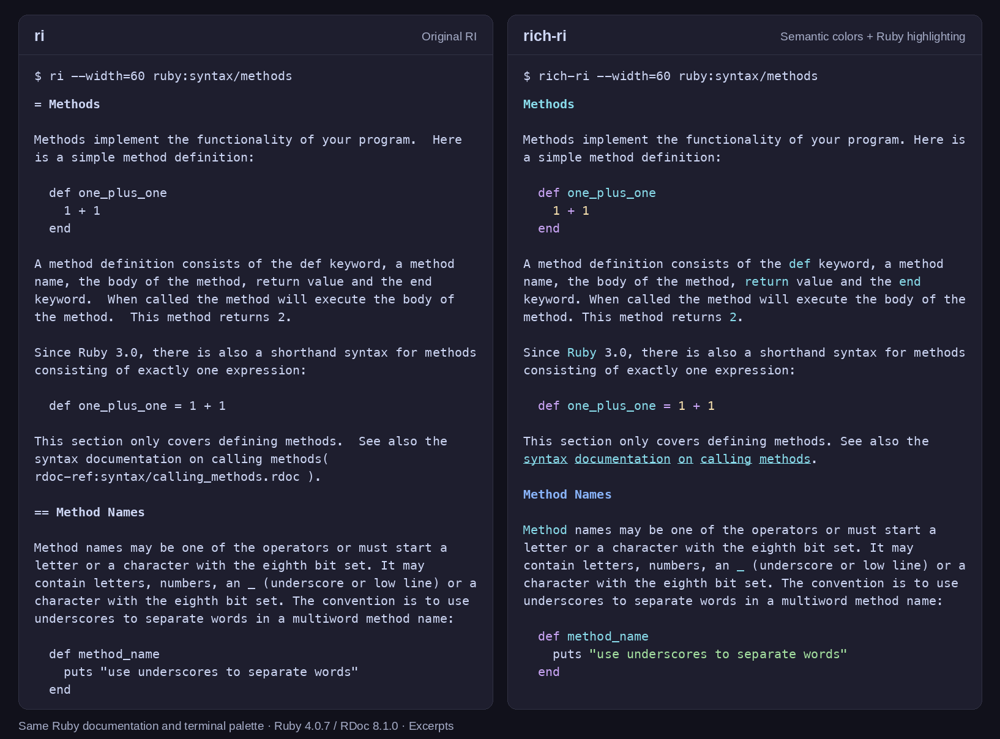

# rich-ri

Read Ruby documentation with clear headings, colored references and highlighted
examples, using the RI documentation already installed for your Ruby and gems.

rich-ri wraps Ruby's original RI reader, provided by RDoc. RDoc handles lookup
and documentation stores; rich-ri adds presentation and discovery features.
It requires the RDoc library, which RubyGems installs as a dependency. Many Ruby
installations already include RDoc and `ri`. rich-ri uses that library directly,
so the separate `ri` executable does not need to be on your `PATH`.



Actual output from `ri` (left) and `rich-ri` (right), using the same documentation,
60-column width and terminal palette. The image shows an excerpt of `ruby:syntax/methods`.

```sh
rich-ri Array#map
rich-ri Hash
rich-ri ruby:syntax/pattern_matching
```

Ruby examples are highlighted with Prism. When bat is installed, rich-ri also
highlights explicitly tagged languages and recognizes shell transcripts such as
`$ echo "hello" | ruby example.rb`. Command output stays plain. Colors follow
your terminal's palette, including light themes.

## Install

Requires Ruby 3.4 or later. The CI matrix covers Ruby 3.4 and 4.0 on Linux, and
Ruby 4.0 on macOS. RDoc 8.1 is the minimum supported RDoc version.

```sh
gem install rich-ri
```

Run `rich-ri` from any shell. Installation does not change your shell configuration.
See [Contributing](CONTRIBUTING.md#set-up) to run a source checkout.

Reading documentation, Ruby highlighting and interactive discovery work without
bat, less or man. These programs add specific capabilities:

- **bat** adds syntax highlighting for shell commands and tagged examples in
  other languages. Without it, those examples remain readable plain code.
- **less**, or another RI-compatible pager, provides scrolling and search.
  `--no-pager` always writes directly to the terminal.
- **man** is needed for `rich-ri --man` and `man rich-ri`. The built-in `--help`
  and manual installation command work without it.

Shell completion has separate setup instructions for Bash, Zsh and Fish below.
Only the Bash adapter requires **bash-completion 2.x**; Zsh and Fish use their
built-in completion systems.

## Read and discover

Names follow RI conventions. Use `Class#method` for instance methods,
`Class::method` for class methods, and `Class.method` to search both.
Quote names containing shell punctuation, such as `rich-ri 'Array.[]'`.

Run `rich-ri` without arguments for interactive lookup. Press Tab to discover
classes, methods and documentation pages; submit an empty line to leave. With shell
completion installed, the same discovery is available before running a command:

```text
rich-ri Str<Tab>
rich-ri String#<Tab>
rich-ri String.<Tab>
rich-ri ruby:<Tab>
rich-ri --<Tab>
```

In less, use `/` to search, `n` for the next match, Space for the next page and
`q` to return. `--no-pager` writes directly to stdout.

```sh
rich-ri --all Array
rich-ri --width=72 String#scan
rich-ri --color=always Array#map | less -R
rich-ri --no-color Hash
rich-ri --format=markdown Array#map
```

`--format` selects an original RDoc formatter. Otherwise, disabling colors
preserves rich-ri's page layout. Code blocks keep their content and indentation;
prose wraps by visible terminal width, including wide Unicode characters.

## Shell completion

Completion reads the active Ruby's RI stores, including `--doc-dir`. It makes no
network requests. It can suggest installed classes, methods, pages, options and
option values. Invalid or unavailable stores produce no suggestions.

### Bash

Load bash-completion 2.x in your shell, then install the lazy-loaded script:

```sh
mkdir -p "${XDG_DATA_HOME:-$HOME/.local/share}/bash-completion/completions"
rich-ri --completion=bash > "${XDG_DATA_HOME:-$HOME/.local/share}/bash-completion/completions/rich-ri"
```

To load it in the current shell, run `source <(rich-ri --completion=bash)`.

### Zsh

After `autoload -Uz compinit && compinit` in your `.zshrc`, add:

```zsh
source <(rich-ri --completion=zsh)
```

### Fish

```fish
mkdir -p "$__fish_config_dir/completions"
rich-ri --completion=fish > "$__fish_config_dir/completions/rich-ri.fish"
```

### Use the short name ri

For Bash, add these lines after loading bash-completion:

```bash
alias ri='rich-ri'
source <(rich-ri --completion=bash)
complete -o filenames -F _rich_ri ri
```

For Zsh, add `alias ri='rich-ri'` after the completion setup. Zsh expands aliases
for completion by default. In Fish, use `alias ri rich-ri` in your configuration;
Fish aliases inherit completions from the wrapped command.

`command ri` still invokes the original RI executable. The alias is optional.

## Documentation sources and missing pages

rich-ri reads installed documentation; it does not download documentation or
generate it while you browse. `rich-ri --list-doc-dirs` shows the searched paths,
and `rich-ri --list` lists known classes.

If a gem was installed with `--no-document`, generate its RI documentation with
`gem rdoc GEM_NAME --ri`. Ruby core documentation depends on how your Ruby was
installed; install the documentation package supplied by your Ruby manager or OS.

### Read your project's documentation

Save this small example as `greeter.rb`:

```ruby
class Greeter
  # Returns a greeting for the given name.
  #
  #   Greeter.new.greet("Ruby") # => "Hello, Ruby!"
  def greet(name)
    "Hello, #{name}!"
  end
end
```

Generate its documentation and read the method:

```sh
rdoc --ri --quiet --op doc/ri greeter.rb
rich-ri --no-standard-docs --doc-dir doc/ri --no-color --no-pager --width=60 Greeter#greet
```

The output below abbreviates the current directory as `.`:

```text
Greeter#greet

(from ./doc/ri)
────────────────────────────────────────────────────────────
  greet(name)

────────────────────────────────────────────────────────────

Returns a greeting for the given name.

  Greeter.new.greet("Ruby") # => "Hello, Ruby!"
```

To use the same documentation sources for lookup and shell completion, configure
`RI` in the current shell:

| Shell | Command |
| --- | --- |
| Bash or Zsh | `export RI='--no-standard-docs --doc-dir doc/ri'` |
| Fish | `set -gx RI '--no-standard-docs --doc-dir doc/ri'` |

Only open RI stores you trust. RI caches use Ruby Marshal serialization; see
[SECURITY.md](SECURITY.md) for the trust boundary.

## Configuration

| Setting | Behavior |
| --- | --- |
| `--color=auto` | Default: colors only on a TTY, unless `NO_COLOR` is nonempty or `TERM=dumb`. |
| `--color`, `--color=always` | Force colors, including in pipes. |
| `--no-color`, `--color=never` | Disable colors. |
| `RI` | Default options, parsed as shell words. Explicit arguments take precedence. |
| `RI_PAGER`, `PAGER` | Select the pager, in that order. These are trusted shell commands. |
| `LESS` | Pager preferences; rich-ri adds `-R` for its child pager. |
| `BAT_THEME` | bat theme for tagged languages; shell commands use `ansi`. |
| `GEM_HOME`, `GEM_PATH` | Select the active RubyGems documentation stores. |
| `HOME`, `PATH` | Locate home documentation and external programs. |

The default prose width follows the terminal up to 96 columns. `--width` accepts
20 columns or more. Shell detection is intentionally conservative: ambiguous
prompts, unclosed quotes and shell heredocs remain plain. Explicit language tags
take precedence over detection. A missing or failing bat leaves the code readable.

## Manual, development and support

`rich-ri --help` lists every option. `rich-ri --man` opens the bundled manual.
To install a copy for `man rich-ri`, run:

```sh
rich-ri --install-man
```

The command prints the destination and any `MANPATH` configuration needed for
discovery. Use `--install-man=DIR` to choose another `man1` directory. Repeat the
command after upgrading the gem. Bash and Fish completion files are also copies;
rerun their installation commands after an upgrade. Zsh's setup loads the script
from the active gem whenever a new shell starts.

The manual uses color when supported and honors existing pager and palette
settings. `--no-color` disables rich-ri's manual palette.

Exit status is 0 on success, 1 for lookup/usage failures and 130 when interrupted.
A closed output pipe is a normal exit.

See [CONTRIBUTING.md](CONTRIBUTING.md) for setup and checks,
[ARCHITECTURE.md](ARCHITECTURE.md) for the rendering and completion boundaries,
and [CHANGELOG.md](CHANGELOG.md) for user-visible changes.
Report bugs or ask usage questions in [GitHub issues](https://github.com/hvpaiva/rich-ri/issues).
Security reports go through the private channel in [SECURITY.md](SECURITY.md).

Released under the [MIT license](LICENSE.txt).
